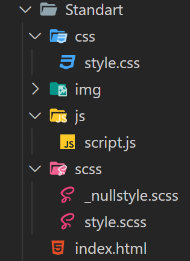

# Standart
---
## HTML
1. Стандартна HTML розмітка До якої підключений єдиний і основний файл стилів CSS та файл JS, Також макет налаштований на адаптив через meta тег
```html
<!DOCTYPE html>
<html lang="en">
	<head>
		<title>Назва сайта</title>
		<link rel="stylesheet" href="css/style.css" />
		<meta http-equiv="Content-type" content="text/html;charset=UTF-8" />
		<meta name="viewport" content="width=device-width, initial-scale=1.0">
	</head>
	<body>
		<script type="text/javascript" src="js/script.js"></script>
	</body>
</html>
```
## CSS/SCSS
1. Файл "scss/_nullstyle.scss" - файл обнулення стандартних стилів у браузері
```scss
/*Обнулення стилів*/
*{padding: 0;margin: 0;border: 0;}
*,*:before,*:after{-moz-box-sizing: border-box;-webkit-box-sizing: border-box;box-sizing: border-box;}
:focus,:active{outline: none;}
a:focus,a:active{outline: none;}
nav,footer,header,aside{display: block;}
html,body{height:100%;width:100%;font-size:100%;line-height:1;font-size:14px;-ms-text-size-adjust:100%;-moz-text-size-adjust:100%;-webkit-text-size-adjust:100%;}
input,button,textarea{font-family:inherit;}
input::-ms-clear{display: none;}
button{cursor: pointer;}
button::-moz-focus-inner{padding:0;border:0;}
a,a:visited{text-decoration: none;}
a:hover{text-decoration: none;}
ul li{list-style: none;}
img{vertical-align: top;}
h1,h2,h3,h4,h5,h6{font-size:inherit;font-weight: inherit;}
/*--------------------*/
```
2. Файл "scss/style.scss" - основний файл стилів який конвертується в CSS, до нього підключається файл "_nullstyle.scss" та якщо потрыбно інші файли із стилями різних частин сайту, наприклад файл із стилями для Header, або файл у якому буде повний адаптив сайту
3. css/style.css - основний файл який підключений до HTML, він заповнюється конвертацією файла "scss/style.scss" за допомогою розштрення "Live SASS Compiler"
## Структура проекту

* Коренна папка проекту
    * Файл "index.html" - основна сторінка сайта
    * Папка "css"
        * файл "style.css"
    * Папка "js"
        * файл "script.js"
        * Можливі додаткові js файли
    * Папка "scss"
        * файл "style.scss"
        * файл "_nullstyle.scss"
        * інші файли для стилів з відповідними назавми
    * Папка "img"
        * Папки із назвами частин сайту
            * Зображення потрібні для цих частин сайту

---
# GULP
---

GULP, Його настройки, версії та функції описані у файлі "package.json"
```json
{
	"name": "fls-start",
	"version": "3.0.0",
	"description": "Start template with Gulp and Webpack",
	"author": "FLS",
	"private": true,
	"license": "",
	"type": "module",
	"scripts": {
		"dev": "gulp && webpack serve --progress -c config/webpack.dev.js",
		"build": "gulp build --build",
		"sprite": "gulp sprite",
		"fonts": "gulp fonts --rewrite",
		"deploy": "gulp deployFTP --build",
		"zip": "gulp deployZIP --build",
		"devbuild": "gulp build --build --nowebp",
		"tmp": "gulp -f gulpfile.tmp.js",
		"bem": "fls-bemtree-from-html"
	},
	"devDependencies": {
		"copy-webpack-plugin": "latest",
		"css-loader": "latest",
		"del": "latest",
		"file-include-webpack-plugin-replace": "latest",
		"fls-bemtree-from-html": "^1.0.0",
		"gulp": "latest",
		"gulp-autoprefixer": "latest",
		"gulp-clean-css": "latest",
		"gulp-fonter-fix": "latest",
		"gulp-group-css-media-queries": "latest",
		"gulp-if": "latest",
		"gulp-imagemin": "latest",
		"gulp-newer": "latest",
		"gulp-notify": "latest",
		"gulp-plumber": "latest",
		"gulp-prettier": "latest",
		"gulp-rename": "latest",
		"gulp-svg-sprite": "latest",
		"gulp-ttf2woff": "latest",
		"gulp-ttf2woff2": "latest",
		"gulp-util": "latest",
		"gulp-version-number": "latest",
		"gulp-webp": "latest",
		"gulp-webp-html-nosvg": "latest",
		"gulp-webpcss": "latest",
		"gulp-zip": "latest",
		"html-webpack-plugin": "latest",
		"inputmask": "latest",
		"lightgallery": "latest",
		"load-plugins": "latest",
		"mini-css-extract-plugin": "2.4.7",
		"nouislider": "latest",
		"pug": "latest",
		"pug-loader": "latest",
		"sass": "latest",
		"sass-loader": "latest",
		"smooth-scroll": "latest",
		"string-replace-loader": "latest",
		"style-loader": "latest",
		"swiper": "latest",
		"terser-webpack-plugin": "latest",
		"tippy.js": "latest",
		"transform-runtime": "0.0.0",
		"vanilla-lazyload": "latest",
		"vinyl-ftp": "latest",
		"webp-converter": "2.2.3",
		"webpack": "latest",
		"webpack-cli": "latest",
		"webpack-dev-server": "latest",
		"webpack-stream": "latest"
	},
	"dependencies": {
		"simplebar": "latest"
	}
}
```